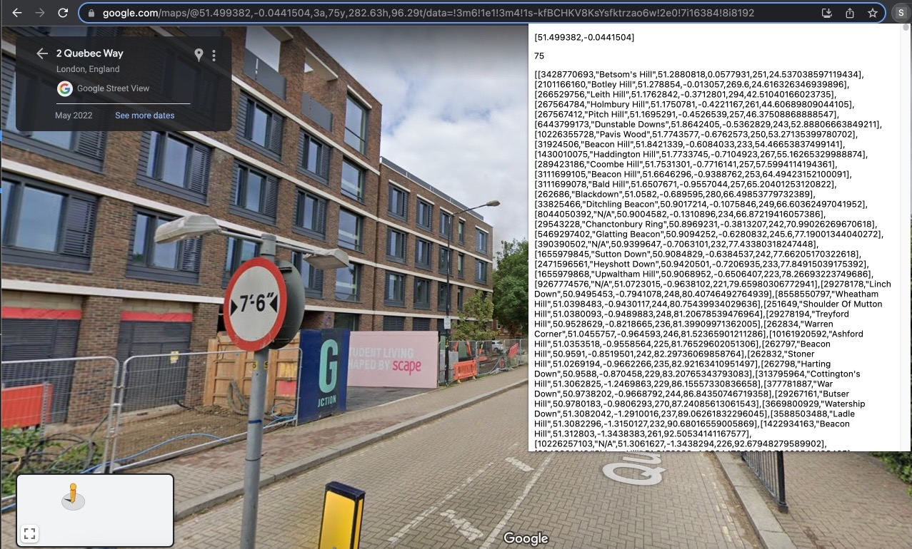

# Streetview Places Chrome Extension

This is a Chrome extension that enhances Google Street View by displaying nearby points of interest on the user's screen. 

## Features
- Displays nearby peaks, summits, and mountain ranges visible from the current viewpoint in Google Street View.
- Displays the coordinates of the user's current location.
- Displays the orientation of the user's view.

## Installation
1. Clone the repository to your local machine.
2. Open Chrome and navigate to `chrome://extensions`.
3. Toggle Developer mode to ON.
4. Click on Load unpacked and select the directory where you cloned the repository.

## Usage
1. Open Google Street View in your browser.
2. The extension will automatically display nearby peaks and summits in the user's view.

**Note**: This extension requires a Flask server to retrieve data about nearby peaks and summits. At the moment, the server must be run locally on the user's machine. However, the developer plans to host the server soon. To run the Flask server locally, navigate to the root directory of the project in your terminal and run the command `python app.py`. 

Enjoy exploring the world in a new way!

## Screenshot

